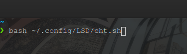
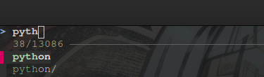
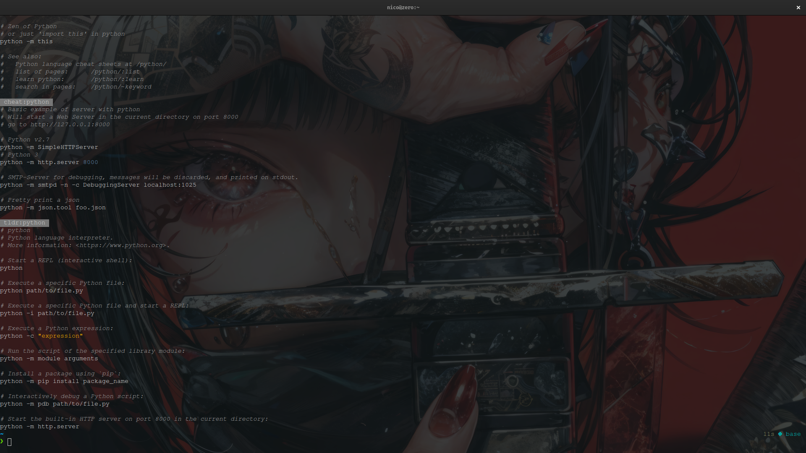

This is My Development env config.

#### Harpoon-Steroids-Switch
[harpoon_switch.webm](https://github.com/nico-Zero/config/assets/91547209/485b05f9-e541-4f8c-8e4b-27960656f7ce)
#### Harpoon-Steroids-Window
[harpoon_window.webm](https://github.com/nico-Zero/config/assets/91547209/a2058a23-aa5d-4d4d-afbc-33393f6a99d5)
#### Harpoon-Steroids-Exit
[exit.webm](https://github.com/nico-Zero/config/assets/91547209/48f55c5c-e5a6-4222-b565-f88885de8b04)

#### Setup
```bash
sh -c "$(curl -fsSL https://raw.githubusercontent.com/nico-Zero/config/main/setup.sh)"
```


#### Cheat Sheet
Install: 
```bash
cd ~/.config
mkdir LSD
cd LSD
curl https://raw.githubusercontent.com/nico-Zero/config/main/.config/LSD/cht.sh > cht.sh
curl https://raw.githubusercontent.com/nico-Zero/config/main/.config/LSD/.cht_language_list.txt > .cht_language_list.txt
```

Sheet Search:


1.  Run the cht.sh file.



2.  Search for Programming-language or Terminal-command:

    Simply Type,

    

    OR

    Select,

    

    Result:

    

    OR
   
    If want to query then just type '/' in the end of search query:

    

    You will get a Prompt asking for query:

    
    
    For Query String:

    

    Result:
    

    Note: If you type query then cht.sh will give result based on query.

    OR

    It will return default result without '/' one.

3.  To Quit press Ctrl-c at any moment.


Thank You For Visiting...
